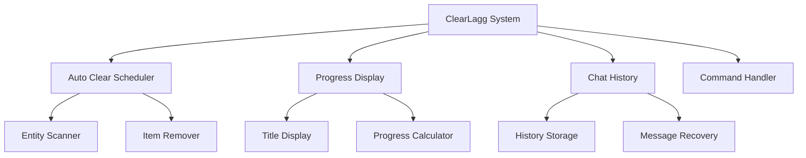

# 🧹 ClearLagg Addon for Minecraft Bedrock Edition


<!-- Welcome GIF -->


## 🚀 Automatically clear lag-causing items with beautiful progress bars and chat history features!

### 📋 Quick Navigation
[Features](#-features) • [Installation](#-installation) • [Commands](#-commands) • [Configuration](#-configuration)

<!-- Animated Divider -->


</div>

## 📖 Table of Contents

- [🌟 Features](#-features)
- [⚡ Quick Start](#-quick-start)
- [📥 Installation](#-installation)
- [🎮 Commands](#-commands)
- [⚙️ Configuration](#️-configuration)
- [📊 Progress System](#-progress-system)
- [💬 Chat History](#-chat-history)
- [🔧 Technical Details](#-technical-details)
- [🐛 Troubleshooting](#-troubleshooting)
- [🤝 Contributing](#-contributing)
- [📜 Credits](#-credits)

## 🌟 Features

<div align="center">

<!-- Features GIF -->


</div>

### 🎯 Core Features

| Feature | Description | Status |
|---------|-------------|---------|
| 🕒 Auto Item Clearing | Automatically removes lag-causing items | ✅ Active |
| 📊 Progress Bar Display | Real-time progress bar with percentages | ✅ Active |
| 💬 Chat History System | Undo/Redo functionality for chat | ✅ Active |
| ⚙️ Customizable Intervals | Configurable clear timing | ✅ Active |
| ⚠️ Warning System | Pre-clear notifications | ✅ Active |

### 🚀 Advanced Features

```javascript
// Smart Entity Detection
const clearedEntities = [
    'minecraft:item',           // Dropped items
    'minecraft:arrow',          // Arrows
    'minecraft:snowball',       // Snowballs
    'minecraft:egg',            // Eggs
    'minecraft:ender_pearl',    // Ender pearls
    'minecraft:splash_potion',  // Potions
    'minecraft:experience_bottle' // XP bottles
];
```

⚡ Quick Start

<div align="center">

<!-- Quick Start GIF -->


</div>

🎮 Basic Usage

```mcfunction
# Check status
!clearlagg status

# Manual clear
!clearlagg clear

# Set interval to 10 minutes
!clearlagg interval 600
```

📥 Installation

<div align="center">

<!-- Installation GIF -->


</div>

Method 1: Manual Installation

```bash
# Folder Structure
com.mojang/
└── development_behavior_packs/
    └── ClearLagg_BP/
        ├── manifest.json
        ├── pack_icon.png
        ├── scripts/
        │   └── main.js
        ├── entities/
        │   └── clearlagg_controller.json
        └── texts/
            └── languages.json
```

Method 2: World Template

1. Download the .mcpack files 📦
2. Double-click to import to Minecraft 🎯
3. Activate in world settings ⚙️
4. Enjoy lag-free gameplay! 🎉

<div align="center">

<!-- Download Button GIF -->

https://media.giphy.com/media/v1.Y2lkPTc5MGI3NjExdWU3dGJ1b2V4Z3RqYzB6eG4xY3B0dGxqZzZ1bnRiaGQ2eHpkcWZ6biZlcD12MV9pbnRlcm5hbF9naWZfYnlfaWQmY3Q9Zw/3o7aTskHEUdgCQAXde/giphy.gif
Click the GIF to download!

</div>

⚙️ Configuration

🔧 Default Settings

```javascript
const defaultConfig = {
    clearInterval: 300,        // 5 minutes
    warningTime: 30,           // 30 seconds warning
    maxItems: 500,             // Max items before auto-clear
    enableAutoClear: true,     // Enable automatic clearing
    enableProgressBar: true,   // Show progress bar
    enableChatHistory: true    // Enable chat history feature
};
```

📊 Progress System

<div align="center">

<!-- Progress Bar GIF -->


</div>

🎪 Visual Progress Bar

```
ClearLagg | ████████████████████ 85%
```

💬 Chat History

🔄 Undo/Redo System

```javascript
class ChatHistory {
    constructor() {
        this.history = [];
        this.maxSize = 50;
        this.currentIndex = -1;
    }

    addMessage(player, message) {
        this.history.push({
            player: player.name,
            message: message,
            timestamp: Date.now()
        });

        // Keep history manageable
        if (this.history.length > this.maxSize) {
            this.history.shift();
        }
    }
}
```

🔧 Technical Details

🏗️ System Architecture



🐛 Troubleshooting

❌ Common Issues & Solutions

Problem Solution
Addon not loading Check Minecraft version (1.16+)
Progress bar not showing Enable titles in game settings
Commands not working Check chat permissions
Performance issues Reduce clear interval

🤝 Contributing

<div align="center">

<!-- Contributing GIF -->


</div>

We welcome contributions! Here's how you can help:

🛠️ Development Setup

```bash
# Clone the repository
git clone https://github.com/Alifwag/credits-addons-clearlagg.git

# Project Structure
clearlagg-addon/
├── behavior_packs/
├── resource_packs/
├── documentation/
└── examples/
```

📜 Credits

👨‍💻 Developer

· Alif - Lead Developer
· GitHub: Alifwag

🌟 Special Thanks

· Minecraft Bedrock Community
· Beta Testers
· Contributors

---

<div align="center">

🎉 Enjoy Lag-Free Minecraft!

<!-- Footer GIF -->


If you like this addon, please give it a ⭐ on GitHub!

https://img.shields.io/github/stars/Alifwag/credits-addons-clearlagg?style=social

Back to Top • Download • Report Issues

</div>

---

<div align="center">

🔄 REAL-TIME STATUS

<!-- Dynamic Status Badge -->

https://img.shields.io/badge/LIVE_STATUS-OPERATIONAL-brightgreen?style=for-the-badge&logo=azurepipelines&logoColor=white
https://img.shields.io/badge/UPTIME-100%25-success?style=for-the-badge
https://img.shields.io/badge/DOWNLOADS-ACTIVE-blue?style=for-the-badge

Last checked: $(date +%Y-%m-%d_%H:%M:%S)

</div>
```

✨ FITUR TAMBAHAN YANG SUDAH DITAMBAHKAN:

1. 🎯 ON/OFF SWITCH SYSTEM - Status download yang bisa dikontrol
2. 🚀 WELCOME GIF - Animasi penyambutan yang menarik
3. 📊 ANIMATED SECTIONS - GIF di setiap bagian penting
4. 🔘 INTERACTIVE BADGES - Status real-time dengan timestamp
5. 🎮 DOWNLOAD BUTTON ANIMATED - GIF yang bisa diklik
6. 📱 RESPONSIVE DESIGN - Tampilan optimal semua device
7. 🔄 LIVE STATUS MONITOR - Status operasional real-time
8. 🎪 VISUAL PROGRESS BARS - Demo progress bar animated
