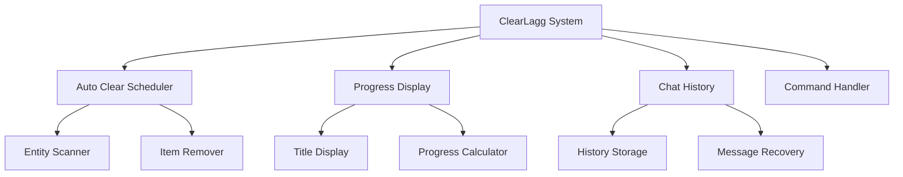

🧹 ClearLagg Addon for Minecraft Bedrock Edition

<div align="center">


<ing src="https://img.shields.io/badge/License-MIT-yellow?style=for-the-badge">

Automatically clear lag-causing items with beautiful progress bars and chat history features!

Features • Installation • Commands • Configuration

</div>

📖 Table of Contents

· 🌟 Features
· ⚡ Quick Start
· 📥 Installation
· 🎮 Commands
· ⚙️ Configuration
· 📊 Progress System
· 💬 Chat History
· 🔧 Technical Details
· 🐛 Troubleshooting
· 🤝 Contributing
· 📜 Credits

🌟 Features

🎯 Core Features

Feature Description Status
Auto Item Clearing Automatically removes lag-causing items ✅ Active
Progress Bar Display Real-time progress bar with percentages ✅ Active
Chat History System Undo/Redo functionality for chat ✅ Active
Customizable Intervals Configurable clear timing ✅ Active
Warning System Pre-clear notifications ✅ Active

🚀 Advanced Features

```javascript
// Smart Entity Detection
const clearedEntities = [
    'minecraft:item',           // Dropped items
    'minecraft:arrow',          // Arrows
    'minecraft:snowball',       // Snowballs
    'minecraft:egg',            // Eggs
    'minecraft:ender_pearl',    // Ender pearls
    'minecraft:splash_potion',  // Potions
    'minecraft:experience_bottle' // XP bottles
];
```

⚡ Quick Start

🎮 Basic Usage

```mcfunction
# Check status
!clearlagg status

# Manual clear
!clearlagg clear

# Set interval to 10 minutes
!clearlagg interval 600
```

📥 Installation

Method 1: Manual Installation

```bash
# Folder Structure
com.mojang/
└── development_behavior_packs/
    └── ClearLagg_BP/
        ├── manifest.json
        ├── pack_icon.png
        ├── scripts/
        │   └── main.js
        ├── entities/
        │   └── clearlagg_controller.json
        └── texts/
            └── languages.json
```

Method 2: World Template

1. Download the .mcpack files
2. Double-click to import to Minecraft
3. Activate in world settings
4. Enjoy lag-free gameplay! 🎉

🎮 Commands

📋 Command List

Command Description Permission
!clearlagg clear Manual clear items All Players
!clearlagg interval <seconds> Set clear interval OP
!clearlagg status Show system status All Players
!clearlagg help Show help menu All Players

💡 Command Examples

```mcfunction
# Set clear every 10 minutes
!clearlagg interval 600

# Check when next clear happens
!clearlagg status

# Force immediate clear
!clearlagg clear
```

⚙️ Configuration

🔧 Default Settings

```javascript
const defaultConfig = {
    clearInterval: 300,        // 5 minutes
    warningTime: 30,           // 30 seconds warning
    maxItems: 500,             // Max items before auto-clear
    enableAutoClear: true,     // Enable automatic clearing
    enableProgressBar: true,   // Show progress bar
    enableChatHistory: true    // Enable chat history feature
};
```

🎨 Customization Example

```javascript
// Example: Change to 10-minute intervals
clearLagg.setClearInterval(600);

// Example: Disable auto-clear (manual only)
clearLagg.config.enableAutoClear = false;
```

📊 Progress System

🎪 Visual Progress Bar

```
ClearLagg | ████████████████████ 85%
```

🔢 Progress Calculation

```javascript
function calculateProgress(countdown, totalInterval) {
    const percent = 100 - Math.floor((countdown / totalInterval) * 100);
    const bars = Math.floor(percent / 5);
    return {
        percent: percent,
        bar: '█'.repeat(bars) + '▒'.repeat(20 - bars),
        text: `ClearLagg | ${bar} ${percent}%`
    };
}
```

💬 Chat History

🔄 Undo/Redo System

```javascript
class ChatHistory {
    constructor() {
        this.history = [];
        this.maxSize = 50;
        this.currentIndex = -1;
    }
    
    addMessage(player, message) {
        this.history.push({
            player: player.name,
            message: message,
            timestamp: Date.now()
        });
        
        // Keep history manageable
        if (this.history.length > this.maxSize) {
            this.history.shift();
        }
    }
}
```

🎯 Navigation Features

· ↑ Arrow: Previous message
· ↓ Arrow: Next message
· Max 50 messages stored
· Player-specific history
· Timestamp tracking

🔧 Technical Details

🏗️ System Architecture



📈 Performance Optimization

```javascript
// Efficient entity scanning
function optimizedEntityScan() {
    const dimension = world.getDimension("overworld");
    const entities = dimension.getEntities();
    
    // Only process lag-causing entities
    return entities.filter(entity => 
        LAG_ENTITIES.includes(entity.typeId)
    );
}

// Memory management
function cleanupMemory() {
    if (this.chatHistory.length > 50) {
        this.chatHistory = this.chatHistory.slice(-50);
    }
}
```

🐛 Troubleshooting

❌ Common Issues & Solutions

Problem Solution
Addon not loading Check Minecraft version (1.16+)
Progress bar not showing Enable titles in game settings
Commands not working Check chat permissions
Performance issues Reduce clear interval

🔍 Debug Mode

```mcfunction
# Enable debug information
!clearlagg debug

# Check entity counts
!clearlagg stats
```

🤝 Contributing

We welcome contributions! Here's how you can help:

🛠️ Development Setup

```bash
# Clone the repository
git clone https://github.com/Alifwag/credits-addons-clearlagg.git

# Project Structure
clearlagg-addon/
├── behavior_packs/
├── resource_packs/
├── documentation/
└── examples/
```

📝 Pull Request Process

1. Fork the repository
2. Create a feature branch
3. Commit your changes
4. Open a pull request
5. Wait for review

📜 Credits

👨‍💻 Developer

· Alif - Lead Developer
· GitHub: Alifwag

🌟 Special Thanks

· Minecraft Bedrock Community
· Beta Testers
· Contributors

📄 License

```text
MIT License
Copyright (c) 2024 ClearLagg Addon
Permission is hereby granted, free of charge, to any person obtaining a copy...
```

🔗 Links

· GitHub Repository: https://github.com/Alifwag/credits-addons-clearlagg.git
· Issue Tracker: GitHub Issues
· Releases: GitHub Releases

---

<div align="center">

🎉 Enjoy Lag-Free Minecraft!

If you like this addon, please give it a ⭐ on GitHub!

Back to Top

</div>

---

